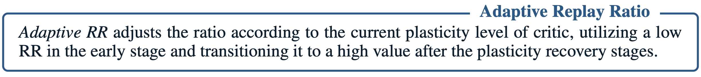

<p align="center">

  <h1 align="center">Adaptive Replay Ratio Implementation on DMC</h1>
  <h2 align="center"><a href="https://arxiv.org/abs/2310.07418">Revisiting Plasticity in Visual RL: Data, Modules and Training Stages</a></h2>
  <p align="center">
    <a><strong>Guozheng Ma*</strong></a>
    ·
    <a><strong>Lu Li*</strong></a>
    ·
    <a><strong>Sen Zhang</strong></a>
    ·
    <a><strong>Zixuan Liu</strong></a>
    ·
    <a><strong>Zhen Wang</strong></a>
  </p>
  <p align="center">
    <a><strong>Yixin Chen</strong></a>
    ·
    <a><strong>Li Shen</strong></a>
    ·
    <a><strong>Xueqian Wang</strong></a>
    ·
    <a><strong>DaCheng Tao</strong></a>
  </p>

</p>

<div align="center">
  
</div>

>Initially, a low RR is adopted to prevent catastrophic plasticity loss. In later training stages, RR can be raised to boost reuse frequency, as the plasticity dynamics become benign. This balance allows us to sidestep early high RR drawbacks and later harness the enhanced sample efficiency from greater reuse frequency.
>
>Furthermore, the FAU of critic module can be employed adaptively to identify the current training stage. Once the critic’s FAU has recovered to a satisfactory level, it indicates the agent has moved beyond the early training phase prone to catastrophic plasticity loss, allowing for an increase in the RR value.

<div align="center">
  
</div>


## Setup

Install [MuJoCo](http://www.mujoco.org/) if it is not already installed:

- Obtain a license on the [MuJoCo website](https://www.roboti.us/license.html).
- Download MuJoCo binaries [here](https://www.roboti.us/index.html).
- Unzip the downloaded archive into `~/.mujoco/mujoco200` and place your license key file `mjkey.txt` at `~/.mujoco`.
- Use the env variables `MUJOCO_PY_MJKEY_PATH` and `MUJOCO_PY_MUJOCO_PATH` to specify the MuJoCo license key path and the MuJoCo directory path.
- Append the MuJoCo subdirectory bin path into the env variable `LD_LIBRARY_PATH`.

Install the following libraries:

```
sudo apt update
sudo apt install libosmesa6-dev libgl1-mesa-glx libglfw3
```

Install dependencies:

```
conda env create -f conda_env.yml
conda activate drqv2
```

## Training Agent

Train DrQ-v2 agent with **Adaptive Replay Ratio(Our method)**:

```
bash train_adapt_rr.sh
```

## 📝 Citation
If this repository is useful to you, please consider citing our paper:
```
@inproceedings{
  ma2024revisiting,
  title={Revisiting Plasticity in Visual Reinforcement Learning: Data, Modules and Training Stages},
  author={Guozheng Ma and Lu Li and Sen Zhang and Zixuan Liu and Zhen Wang and Yixin Chen and Li Shen and Xueqian Wang and Dacheng Tao},
  booktitle={The Twelfth International Conference on Learning Representations},
  year={2024},
  url={https://openreview.net/forum?id=0aR1s9YxoL}
}
```

## 🙏 Acknowledgements

We would like to thank Denis Yarats for open-sourcing the [DrQv2 codebase](https://github.com/facebookresearch/drqv2). Our implementation builds on top of their repository.

